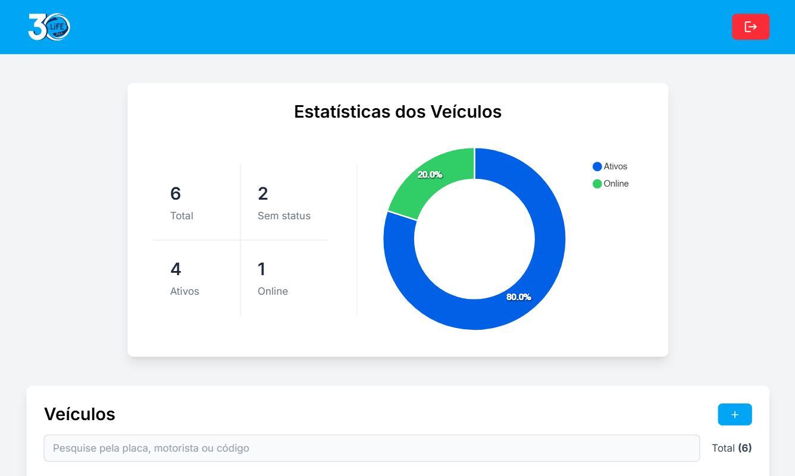
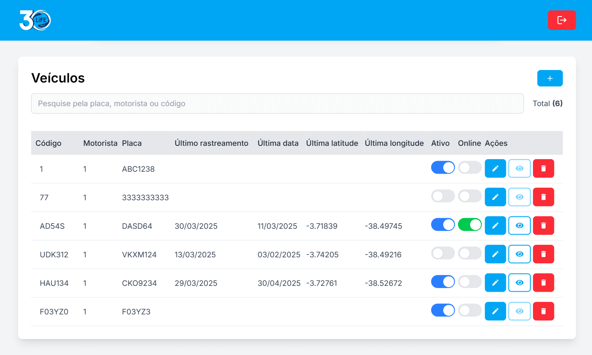
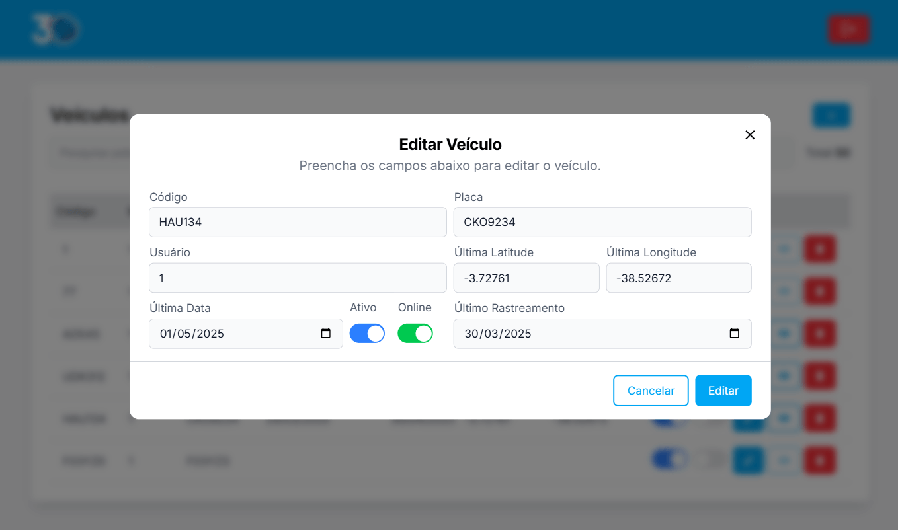
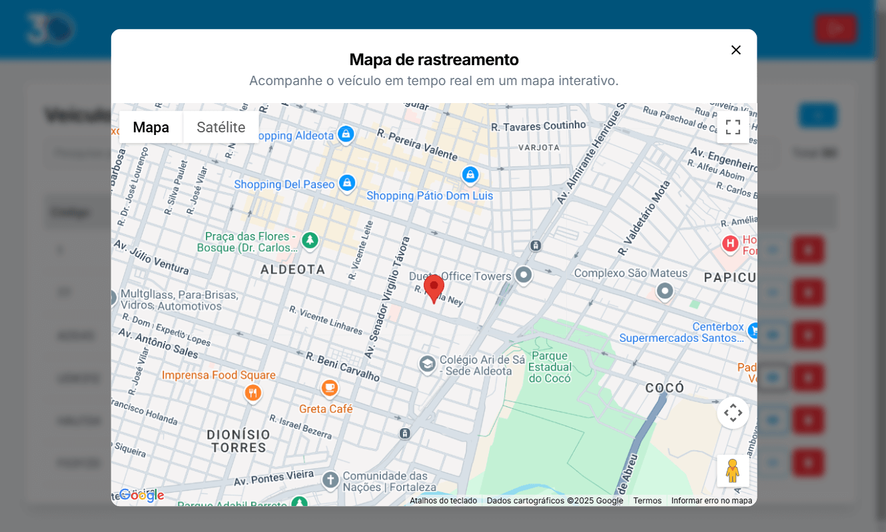

<p align="left">
    
</p>

# Life

[](https://github.com/andrelcalado)
[](#)
[](https://github.com/andrelcalado/life/stargazers)

---
<p align="center" style="display: grid; grid-template-columns: repeat(2, 1fr);">
   
   
   
   
</p>

<p align="center">
   <a href="https://life-test.vercel.app/">Projeto in-live 🎉</a>
</p>

---

# :pushpin: Sumário

* [Requerimentos](#wrench-requerimentos)
* [Rodando Localmente](#rocket-rodando-localmente)

## :wrench: Requerimentos

1. Node v18^. [[Instale aqui]](https://nodejs.org/en/download)

2. Google Maps API Key. [[Consiga aqui]](https://console.cloud.google.com/google/maps-apis/credentials)

3. Copie o arquivo de exemplo
```bash
cp .env.example .env.local
```

4. Abra o arquivo `.env.local` e insira sua chave da API do Google Maps na variável `NEXT_PUBLIC_GOOGLE_MAPS_API_KEY`

5. Instale todas as dependências
```bash
npm install
```

## :rocket: Rodando Localmente

Após finalizar todos os [requisitos](#wrench-requerimentos), execute o comando:

```bash
yarn run dev
```